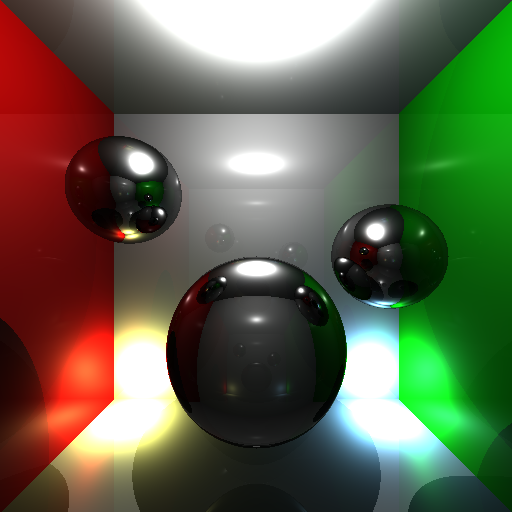
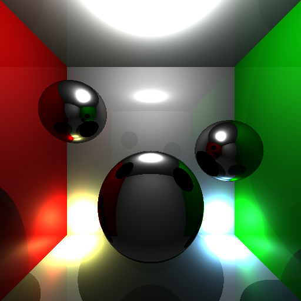
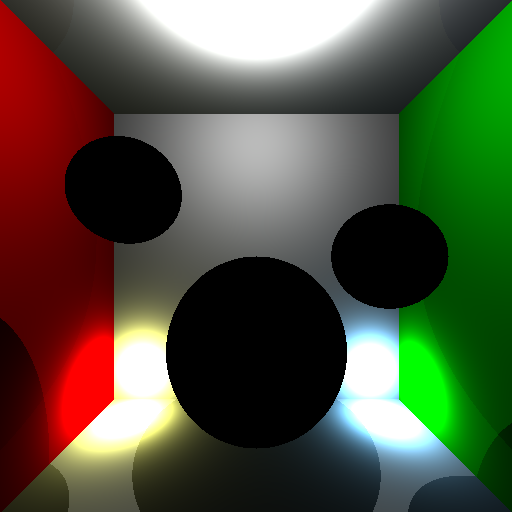

# [Lucifer]

> [Lucifer] is a CPU ray-tracer implemented in TypeScript for [Deno]. It is a
> direct translation of [raymancer], which is an earlier ray-tracer of mine
> written in Kotlin.

[![License][license-shield]](LICENSE) [![Deno doc][deno-doc-shield]][deno-doc]
[![Deno module][deno-land-shield]][deno-land]
[![Github tag][github-shield]][github] [![Build][build-shield]][build]
[![Code coverage][coverage-shield]][coverage]

# Results

These images were generated with dimensions `512 x 512` pixels and decreasing
number of ray bounces (from 4 to 1). With fewer bounces, reflections become less
and less sophisticated.

# Future Work

This project is still very much work in progress and a lot could be improved:

- Add controls for image size and depth.
- Indicate rendering progress.
- Allow non-square images.
- Move rendering to service-worker.
- Optimize performance / move to GPU.

# That's it!

[Lucifer on GitHub][github]

[Lucifer]: #
[Raymancer]: https://github.com/eibens/raymancer
[Deno]: https://deno.land

<!-- badges -->

[github]: https://github.com/eibens/lucifer
[github-shield]: https://img.shields.io/github/v/tag/eibens/lucifer?label&logo=github
[coverage-shield]: https://img.shields.io/codecov/c/github/eibens/lucifer?logo=codecov&label
[license-shield]: https://img.shields.io/github/license/eibens/lucifer?color=informational
[coverage]: https://codecov.io/gh/eibens/lucifer
[build]: https://github.com/eibens/lucifer/actions/workflows/ci.yml
[build-shield]: https://img.shields.io/github/workflow/status/eibens/lucifer/ci?logo=github&label
[deno-doc]: https://doc.deno.land/https/deno.land/x/lucifer/mod.ts
[deno-doc-shield]: https://img.shields.io/badge/doc-informational?logo=deno
[deno-land]: https://deno.land/x/lucifer
[deno-land-shield]: https://img.shields.io/badge/x/lucifer-informational?logo=deno&label
